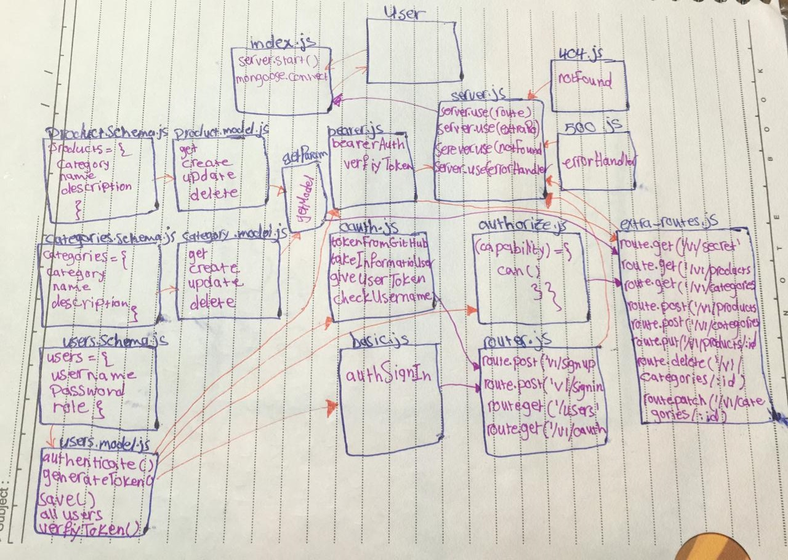

# authenticated-api-server

## class 15
- [github action](https://github.com/sondos-401-advanced-javascript/auth-server/actions)

### test
by using `npm test` and `npm run lint`

### End Point
- /v1/signin 
- /v1/signup
- /users
- /oauth
- /v1/secret
- v1/categories, v1/products >>get to read [admin, writer, regular, editor]
- v1/categories/:id, v1/products/:id >>get to read one [admin, writer, regular, editor]
- /v1/categories, /v1/products >>post to add [admin, writer, editor]
- /v1/categories/:id, /v1/products/:id >>put or patch to update one [admin, editor]
- /v1/categories/:id, /v1/products/:id >>delete to delete one[admin]

### UML
